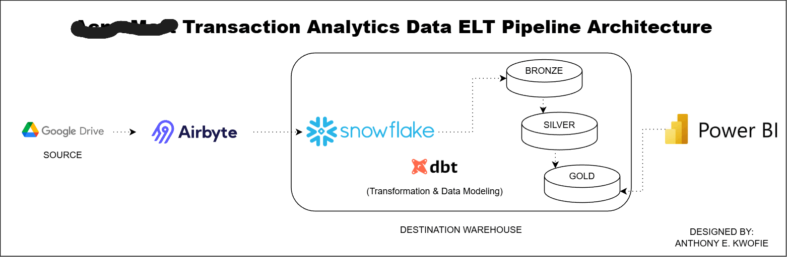
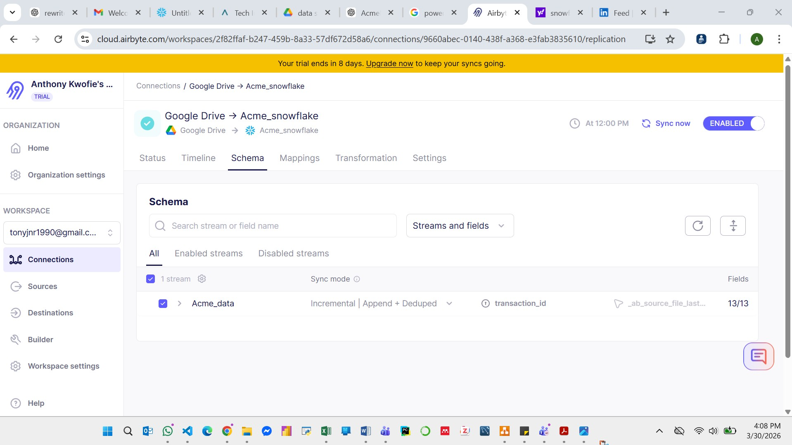
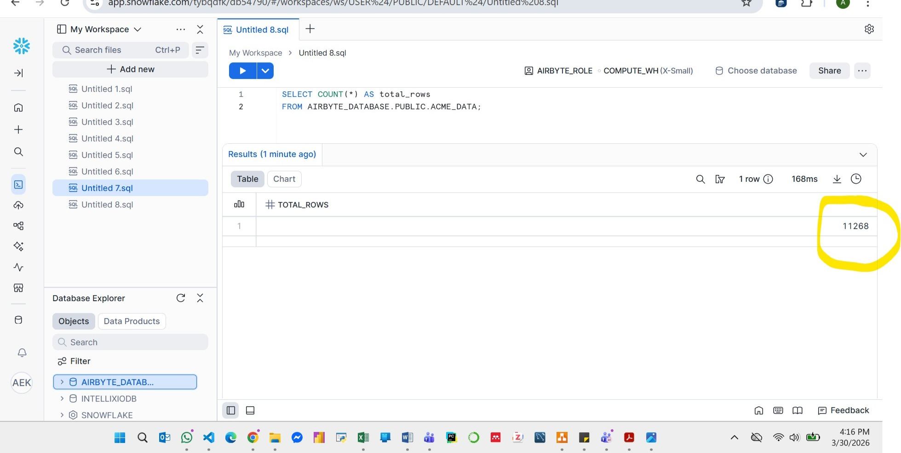
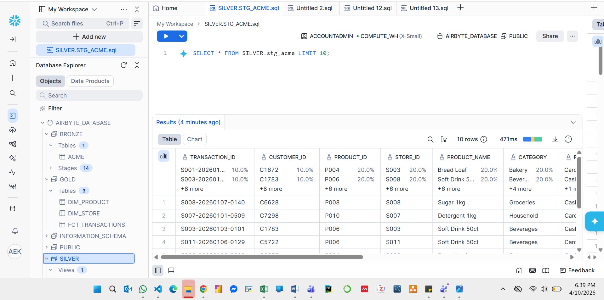
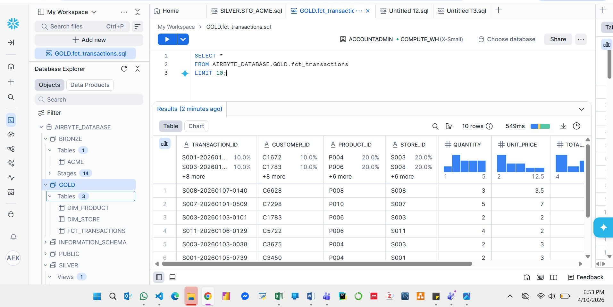

---

# 🛒 AcmeMart Transaction Analytics ELT Pipeline

## 🚀 What This Project Demonstrates
- End-to-end ELT pipeline design  
- Cloud data warehousing with Snowflake  
- Data ingestion using Airbyte  
- Data transformation and testing with dbt  
- Medallion architecture (Bronze → Silver → Gold)  
- Data quality validation and monitoring  

---

## 🧠 Project Overview

This project implements a production-style **ELT data pipeline** for retail transaction data, transforming raw datasets into analytics-ready models.

Data is ingested from **Google Drive via Airbyte**, stored in **Snowflake**, and transformed using **dbt** following the **Medallion Architecture (Bronze → Silver → Gold)**.

---

## 🏗 Architecture



---

## 🔄 Pipeline Walkthrough

### 1️⃣ Data Ingestion (Airbyte)


- Automated ingestion from Google Drive  
- Incremental loading with deduplication  
- **11,268+ records successfully loaded**

---

### 2️⃣ Schema Configuration



- Incremental + Append + Deduped mode  
- Primary key: `transaction_id`  

---

### 3️⃣ Data Validation



- Verified record count consistency (11,268 rows)  
- Confirms successful ingestion  

---

## 🟤 Bronze Layer (Raw Data)

- Raw ingested data stored in Snowflake  
- Table: `AIRBYTE_DATABASE.BRONZE.ACME`

---

## ⚪ Silver Layer (Staging)



- Cleaned and standardized dataset  
- Data type casting and null handling  
- Model: `stg_acme` (view)  

---

## 🟡 Gold Layer (Analytics)



### 📊 Fact Table: `fct_transactions`

- transaction_id  
- customer_id  
- product_id  
- store_id  
- quantity  
- unit_price  
- total_amount  
- transaction_timestamp  

---

### 📦 Dimension Tables

**dim_product**
- product_id  
- product_name  
- category  

**dim_store**
- store_id  

---

## 🔗 Data Lineage

```text
stg_acme
   ↓
fct_transactions
   ↓
dim_product   dim_store
✅ Data Quality

Data integrity enforced using dbt tests:

Primary key validation (unique, not null)
Referential integrity between fact and dimensions

Results:

✔ 6 tests passed
✔ 0 failures
⚙️ How to Run
dbt run
dbt test
dbt docs generate
dbt docs serve
🛠 Tech Stack
Snowflake (Cloud Data Warehouse)
Airbyte (Data Ingestion)
dbt (Data Transformation)
SQL
Power BI (Analytics)
📊 Business Impact
Eliminates manual data consolidation workflows
Creates a single source of truth for transactions
Improves data consistency and reliability
Enables scalable analytics and reporting
🎯 Key Achievements
Processed 11,268+ records with incremental loading
Implemented deduplication using primary key
Built star schema (fact + dimensions)
Achieved 100% dbt test pass rate
🔐 Notes

Sensitive information (credentials, account IDs, configurations) has been removed or anonymized.

👤 Author

Anthony Eddei Kwofie
Data Engineer

🔗 GitHub: https://github.com/Tony-Kwofie


---

## 🔥 You’re now 100% good

- ✅ Folder name matches → `images/`
