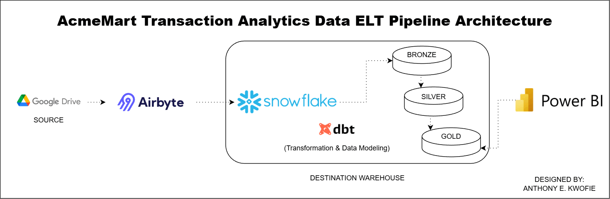
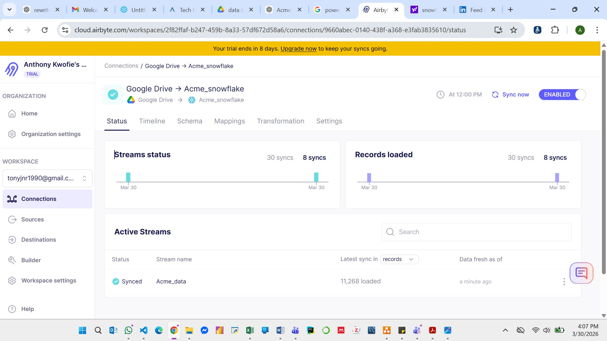

# Retail Data Pipeline (Snowflake + Airbyte + dbt)


A cloud-based data engineering pipeline designed to centralize, automate, and optimize transactional data processing for a **retail organization (name withheld for confidentiality).**

---

# 🧠 Project Context

This project was developed as part of a **real-world data engineering implementation**, focused on building a scalable **ELT data pipeline** to unify distributed retail transaction data and enable analytics-ready reporting.

---

# 📖 Executive Summary

As the organization expanded across multiple store locations, transactional data became fragmented across multiple Excel files stored in Google Drive. This led to:

- Inconsistent data formats  
- Duplicate records  
- Manual consolidation processes  
- Delayed reporting  
- Limited visibility into business performance  

This project implements a **modern ELT-based data pipeline** that automates ingestion, centralizes storage, and prepares data for analytics.

Multiple Excel datasets are ingested via **Airbyte**, loaded into **Snowflake**, and structured using a **Medallion Architecture (Bronze → Silver → Gold)**.

---

# 🏗 Pipeline Architecture

```
Google Drive (Excel Files)
        │
        ▼
Airbyte Cloud
(Data Ingestion / ELT)
        │
        ▼
Snowflake
(Bronze Layer - Raw Data)
        │
        ▼
dbt
(Transformation & Modeling)
        │
        ▼
Snowflake
(Silver & Gold Layers)
        │
        ▼
Power BI
(Reporting & Analytics)
```

---

# 📸 Pipeline Execution

### Architecture Overview


---

### Airbyte Data Sync


---

### Schema Configuration


---

### Snowflake Data Validation

---

# 🛠 Technology Stack

## Cloud & Data Warehouse

- **Snowflake** – Cloud data warehouse  
- **Google Drive** – Source system  

## Data Integration

- **Airbyte Cloud**
- **ELT Architecture**

## Transformation & Modeling

- **dbt (Data Build Tool)** *(in progress)*  
- **SQL**

## Analytics

- **Power BI** *(planned)*  

---

# ⚙ Pipeline Workflow

## 1️⃣ Data Ingestion

Multiple Excel files from Google Drive are ingested using Airbyte.

Configuration:

- Source: Google Drive (folder with multiple files)  
- Destination: Snowflake  
- Sync Mode: Incremental | Append + Deduped  

Deduplication key:

```
transaction_id
```

---

## 2️⃣ Data Warehouse (Bronze Layer)

Raw data is loaded into Snowflake:

```
AIRBYTE_DATABASE.PUBLIC.ACME_DATA
```

Characteristics:

- Raw, untransformed data  
- Source of truth for ingestion  
- Supports incremental updates  

---

## 3️⃣ Data Validation

SQL checks confirm successful ingestion:

```sql
SELECT COUNT(*) AS total_rows
FROM AIRBYTE_DATABASE.PUBLIC.ACME_DATA;
```

**Result:**

```
11,268 rows
```

✔ Data successfully reconciled between source and warehouse  

---

## 4️⃣ Data Transformation (In Progress)

dbt will be used to:

- Clean and standardize data  
- Remove inconsistencies  
- Create structured models  

Layers:

- **Silver Layer** → Cleaned data  
- **Gold Layer** → Analytics-ready tables  

---

## 5️⃣ Analytics Layer (Planned)

Power BI will connect to Snowflake to enable:

- Sales performance dashboards  
- Store-level insights  
- Product analytics  
- Customer behavior analysis  

---

# 📂 Project Structure

```
retail-data-pipeline
│
├── architecture/
│   └── architecture.png
│
├── screenshots/
│   ├── airbyte_schema.png
│   ├── airbyte_sync.png
│   └── snowflake_validation.png
│
├── data/ (optional)
│
├── README.md
```

---

# 🔐 Data Engineering Best Practices

- Incremental ingestion for efficiency  
- Deduplication using primary key (`transaction_id`)  
- Separation of raw and transformed layers  
- Validation checks for data integrity  
- Scalable cloud architecture  

---

# 📊 Business Impact

This pipeline enables:

- Automated data ingestion  
- Centralized data storage  
- Reduced manual reporting  
- Improved data consistency  
- Faster analytics and insights  
- Scalable data infrastructure  

---

# 📈 Future Enhancements

- Complete dbt transformation layer  
- Implement data quality tests  
- Build fact and dimension models  
- Integrate Power BI dashboards  
- Add orchestration (Airflow / scheduling)  
- Optimize warehouse performance  

---

# 🎯 Skills Demonstrated

- ELT Pipeline Design  
- Snowflake Data Warehousing  
- Airbyte Data Integration  
- Data Modeling (dbt)  
- SQL Data Validation  
- Medallion Architecture  
- Cloud Data Engineering  

---

# 👤 Author

**Anthony Eddei Kwofie**  

Data Engineer | SQL | Python | Cloud Data Pipelines  

GitHub:  
https://github.com/Tony-Kwofie  

---

# ⭐ Notes

This project reflects a real-world data engineering implementation focused on building scalable, reliable, and production-aligned data pipelines using modern tools.
